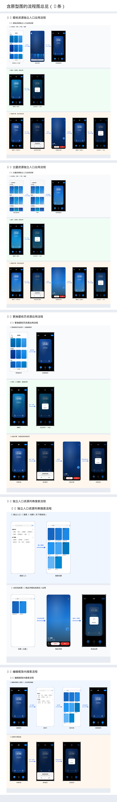
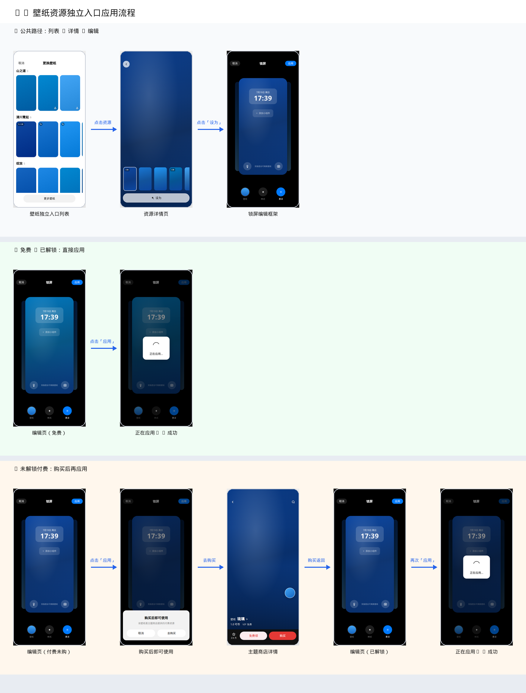
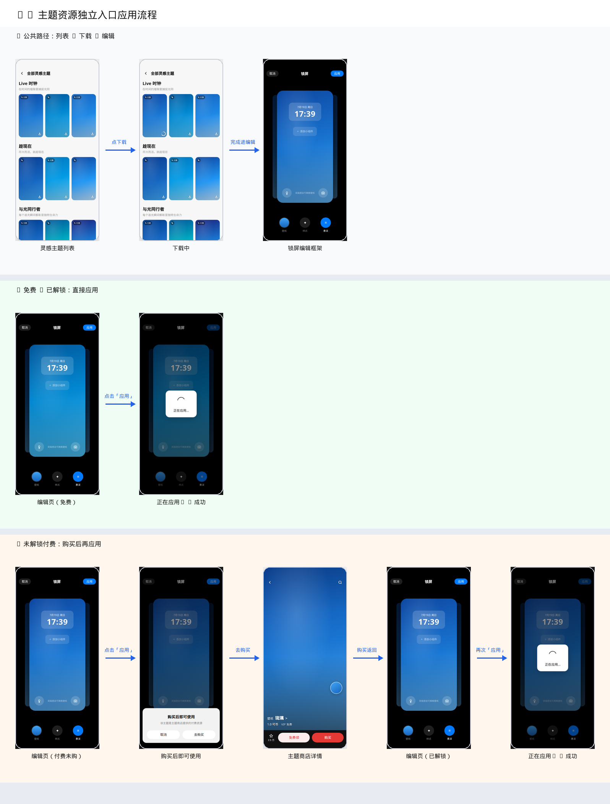
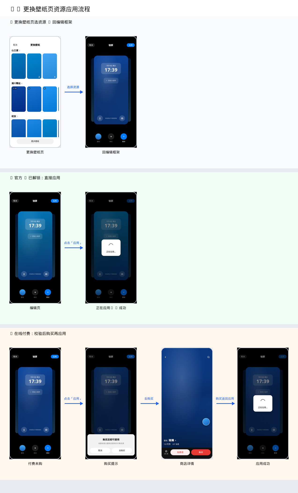
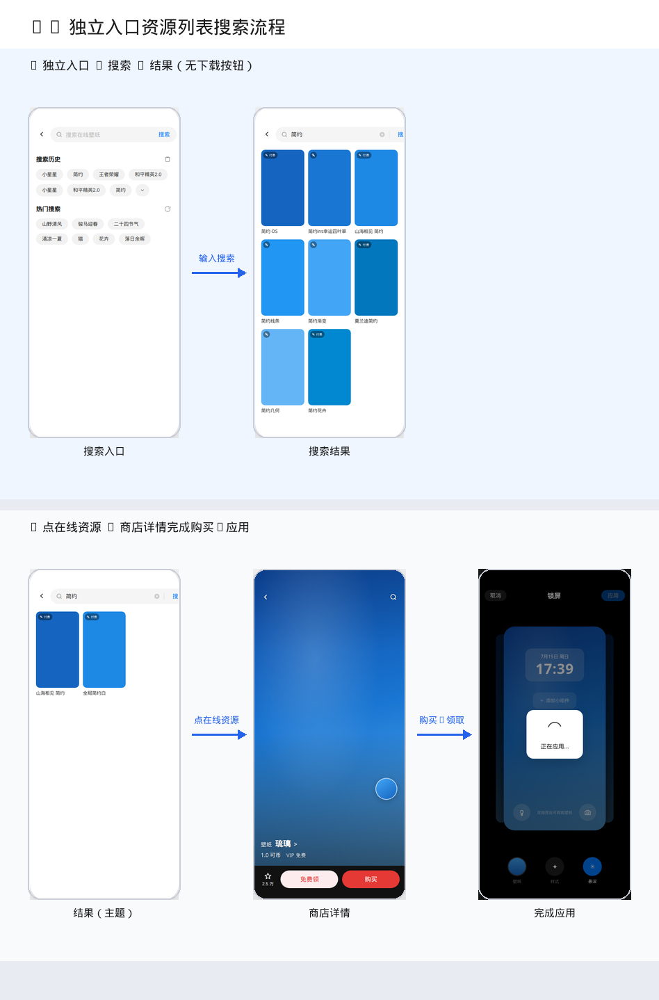
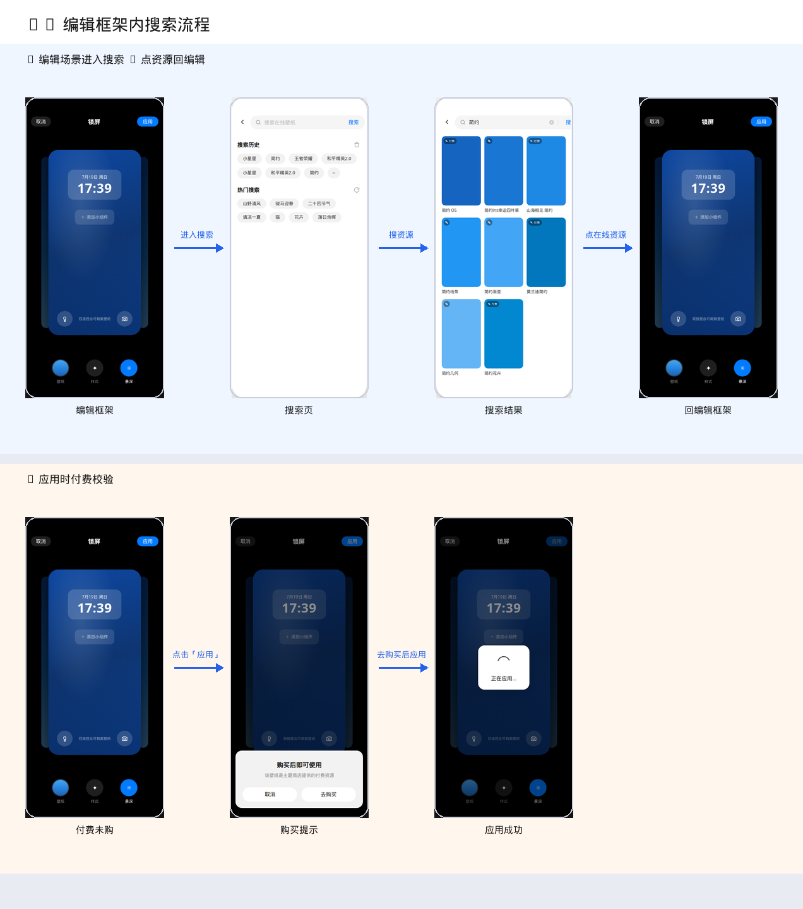

# 5 条流程 · 原型图预览（直接看图）

> 打开本 Markdown 文件即可看到截图（不要点 `.html`，GitHub/源码视图会显示代码）。
> 也可直接打开下方 `previews/*.png` 图片文件。

---

## 总览

---

## 1. 壁纸资源独立入口应用流程

---

## 2. 主题资源独立入口应用流程

---

## 3. 更换壁纸页资源应用流程

---

## 4. 独立入口资源列表搜索流程

---

## 5. 编辑框架内搜索流程

---

## 单张 PNG（点开即看图）

| # | 流程 | 图片 |
|---|------|------|
| 0 | 总览 | [00-overview.png](previews/00-overview.png) |
| 1 | 壁纸独立入口 | [01-wallpaper-entry.png](previews/01-wallpaper-entry.png) |
| 2 | 主题独立入口 | [02-theme-entry.png](previews/02-theme-entry.png) |
| 3 | 更换壁纸页 | [03-change-wallpaper.png](previews/03-change-wallpaper.png) |
| 4 | 独立入口搜索 | [04-search-independent.png](previews/04-search-independent.png) |
| 5 | 编辑框架内搜索 | [05-search-in-edit.png](previews/05-search-in-edit.png) |
